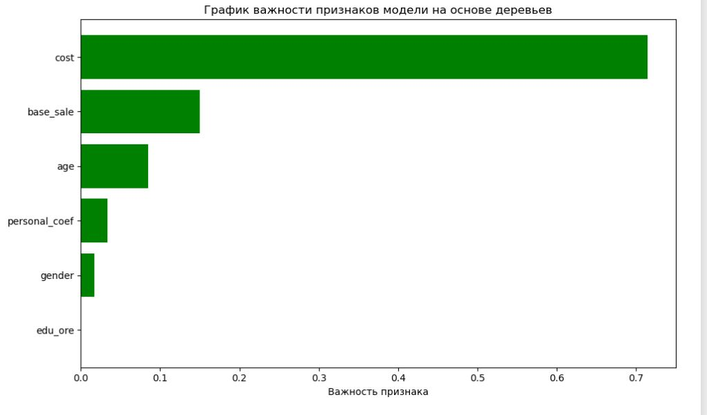

# Анализ эффективности маркетинговых кампаний магазина спортивных товаров

### Описание проекта
Проект направлен на исследование клиентской базы магазина спортивных товаров. На основе социально-демографических признаков и истории покупок проведен комплексный анализ эффективности маркетинга и построена модель склонности к покупке.

### Цель
Анализ результатов прошлых маркетинговых активностей и выявление ключевых факторов, способных повысить объем продаж и конверсию.

### Стек технологий
*   **Python (`pandas`, `matplotlib`, `scipy`, `sklearn`, `kmodes`, `sqlite3`)**: 
    *   **ETL**: Сборка единого аналитического массива из разрозненных источников, восстановление пропущенных данных.
    *   **Statistical Analysis**: Проведение A/B-тестирования для оценки маркетингового воздействия.
    *   **Machine Learning**: Кластеризация клиентов и построение модели склонности к покупке (propensity modeling).
*   **Бизнес-аналитика**:
    *   Подготовка подробного аналитического отчета (методология + выводы).
    *   Создание стратегической презентации для продуктовой команды.

### Описание данных
*В связи с политикой конфиденциальности исходные данные не представлены в репозитории. Работа велась с тремя таблицами из базы данных:*
*   **personal_data**: социально-демографические профили клиентов (пол, возраст, образование, гео).
*   **personal_data_coeffs**: закрытые расчетные коэффициенты лояльности клиентов.
*   **purchases**: транзакционные данные (товары, цвета, стоимость, скидки, даты).

### Ключевые этапы работы
1.  **Предобработка данных**: Восстановление утерянной информации о клиентах, обработка выбросов, генерация новых признаков.
2.  **Статистический анализ**: Оценка влияния маркетинговых кампаний на поведение пользователей через статистические тесты.
3.  **ML-моделирование**: 
    *   Сегментация клиентской базы с использованием алгоритмов кластеризации.
    *   Определение значимости факторов, влияющих на вероятность совершения покупки.

### Ключевые выводы
*   **Эффективность маркетинга**: Текущая маркетинговая кампания **не принесла статистически значимого роста** покупок, что требует пересмотра стратегии коммуникаций.
*   **Клиентские сегменты**: Выявлен узкий сегмент «премиальных» покупателей, совершающих покупки с высоким средним чеком.
*   **Драйверы продаж**: Основным фактором, влияющим на склонность к покупке (особенно в ключевом регионе — город 1188), является **стоимость товара**.

